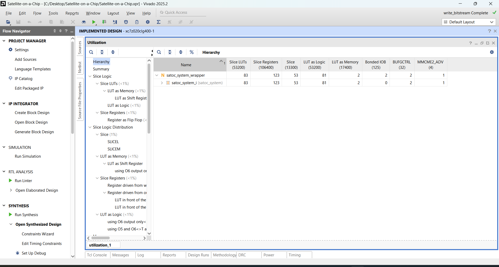
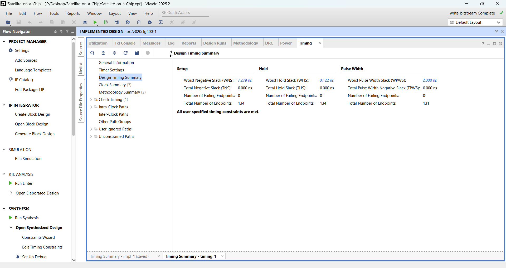

# 🚀 Satellite-on-a-Chip (SAToC)

### FPGA-Based Satellite Digital Subsystem Integration using the NEORV32 RISC-V Processor on the PYNQ-Z2 Development Board

---


---

## 📖 Project Overview

- 
The **Satellite-on-a-Chip (SAToC)** project aims to integrate the primary digital subsystems of a satellite into a single FPGA-based hardware platform. Instead of implementing each subsystem as separate hardware, SAToC combines them into a modular architecture built around the **NEORV32 RISC-V soft processor**, enabling centralized control, efficient communication, and scalability for future satellite applications.

This project has been developed using **AMD Vivado Design Suite 2025.2** and targets the **PYNQ-Z2 Development Board**, which is based on the **Xilinx Zynq-7000 XC7Z020-CLG400-1 FPGA**.

The implemented hardware architecture integrates:

- **NEORV32 RISC-V Soft Processor**
- **Custom SAToC AXI Peripheral**
- **On-Board Data Handling (OBDH) Module**
- **Telemetry, Tracking and Command (TT&C) Module**
- **Electrical Power System (EPS) Module**
- **Memory Controller**
- **AXI SmartConnect Interconnect**
- **Clock Wizard**
- **Processor System Reset**

The complete design was successfully synthesized, implemented, and a hardware bitstream was generated. FPGA resource utilization, timing analysis, and implementation reports confirm that the design meets the required timing constraints while utilizing only a small percentage of the available FPGA resources, leaving significant scope for future subsystem expansion.
---

---

# 🎯 Project Objectives

The primary objective of this project is to design and implement a modular **Satellite-on-a-Chip (SAToC)** architecture that integrates essential satellite digital subsystems into a single FPGA platform. The design focuses on improving system integration, modularity, and scalability while demonstrating the use of an open-source RISC-V processor in an FPGA-based embedded system.

The specific objectives are:

- Design a modular FPGA-based Satellite-on-a-Chip (SAToC) architecture.
- Integrate the **NEORV32 RISC-V soft processor** as the central processing unit.
- Develop a custom **AXI-based SAToC peripheral** for subsystem communication.
- Implement the **On-Board Data Handling (OBDH)** module for data acquisition and management.
- Implement the **Telemetry, Tracking and Command (TT&C)** module for command processing and telemetry exchange.
- Implement the **Electrical Power System (EPS)** monitoring module.
- Design a **Memory Controller** for on-chip data storage and retrieval.
- Validate the complete hardware architecture through synthesis, implementation, and bitstream generation using AMD Vivado 2025.2.
- Analyze FPGA resource utilization and timing performance.
- Develop a hardware platform that can be extended with additional satellite subsystems in future work.
- ---

---

# 🛰️ System Architecture

The SAToC hardware architecture follows a modular design approach in which the **NEORV32 RISC-V soft processor** communicates with custom satellite subsystems through an **AXI4 interconnect**. The processor acts as the central controller, while dedicated hardware modules perform subsystem-specific operations.

```text
                 +----------------------+
                 |    NEORV32 CPU       |
                 |   (RISC-V Processor) |
                 +----------+-----------+
                            |
                      AXI Interconnect
                            |
        +---------+---------+---------+---------+
        |         |         |         |         |
      OBDH      TT&C      Memory      EPS    GPIO
```


The major hardware components implemented in the design are:

## NEORV32 RISC-V Processor

The NEORV32 is an open-source 32-bit RISC-V soft processor integrated into the FPGA fabric. It provides the processing capability required for satellite command execution and subsystem control.

---

## AXI SmartConnect

The AXI SmartConnect IP serves as the communication backbone of the design. It connects the NEORV32 processor to the custom SAToC AXI peripheral, enabling high-speed data exchange between the processor and the satellite subsystems.

---

## SAToC AXI Peripheral

A custom AXI peripheral was developed to interface the processor with the implemented satellite modules. This peripheral provides register-based communication for subsystem control and monitoring.

---

## Clock Generation

The Clock Wizard IP generates the required system clock for the processor and all custom peripherals, ensuring synchronized operation throughout the design.

---

## Processor System Reset

The Processor System Reset module provides reliable reset synchronization for all hardware components during power-up and system reset.

---

## Vivado Block Design

The complete hardware architecture implemented in Vivado is shown below.


---

# 🔧 Implemented Hardware Modules

The SAToC hardware platform consists of several custom VHDL modules integrated through the AXI interconnect. Each module performs a dedicated function within the overall satellite architecture.

---

## 🖥️ NEORV32 RISC-V Processor

The NEORV32 soft-core processor serves as the central processing unit of the SAToC architecture. It executes software routines, controls peripheral communication, and manages the overall operation of the satellite subsystems.

**Key Features**

- 32-bit RISC-V architecture
- Soft-core FPGA implementation
- AXI-based peripheral communication
- Modular and open-source design

---

## 📡 SAToC AXI Peripheral

A custom AXI peripheral was developed to interface the processor with the satellite hardware modules. It provides a standard AXI communication interface for exchanging commands, telemetry, and subsystem status information.

**Functions**

- Processor-to-peripheral communication
- Register-based data transfer
- Interface between hardware modules and processor

---

## 📥 On-Board Data Handling (OBDH)

The OBDH module acts as the central data management subsystem. It receives sensor information, organizes incoming data, and forwards it to the memory subsystem or processor when required.

**Responsibilities**

- Sensor data acquisition
- Data organization
- Internal data routing

---

## 📶 Telemetry, Tracking and Command (TT&C)

The TT&C module is responsible for command reception and telemetry transmission within the SAToC architecture.

**Responsibilities**

- Command reception
- Telemetry generation
- Communication with the processor through the AXI interface

---

## 🔋 Electrical Power System (EPS)

The EPS module monitors power-related parameters required by the satellite system.

**Responsibilities**

- Battery voltage monitoring
- Battery current monitoring
- Housekeeping data generation
- Power status reporting

---

## 💾 Memory Controller

The Memory Controller manages temporary data storage inside the FPGA.

**Responsibilities**

- Read operations
- Write operations
- Address decoding
- Memory interface management

---

## ⏱️ Clock Wizard

The Clock Wizard generates the internal clock used by the processor and all custom peripherals, ensuring synchronized operation throughout the system.

---

## 🔄 Processor System Reset

The Processor System Reset IP guarantees reliable initialization of all modules during startup and reset events.
---

# 🛠️ Vivado Design Flow

The complete SAToC hardware platform was developed using **AMD Vivado Design Suite 2025.2** following the standard FPGA design flow.

## Design Methodology

The implementation followed the sequence shown below:

1. Project Creation
2. IP Integration
3. Block Design Development
4. RTL Integration
5. Design Validation
6. Synthesis
7. Implementation
8. Bitstream Generation
9. Hardware Export (.XSA)

---

## Step 1 — Project Creation

A new RTL project was created in Vivado targeting the **PYNQ-Z2 Development Board** (Xilinx Zynq-7000 XC7Z020-CLG400-1).

---

## Step 2 — IP Integration

The following IP cores were integrated into the Block Design:

- NEORV32 RISC-V Processor
- AXI SmartConnect
- Clock Wizard
- Processor System Reset
- SAToC AXI Peripheral

---

## Step 3 — RTL Integration

Custom VHDL modules were developed and integrated into the SAToC architecture:

- OBDH
- EPS
- TT&C
- Memory Controller
- SAToC Top Module

---

## Step 4 — Design Validation

The Block Design was validated to ensure that all interfaces, clocks, and resets were correctly connected before synthesis.

---

## Step 5 — Synthesis

RTL synthesis successfully translated the VHDL design into an FPGA netlist without critical errors.


---

## Step 6 — Implementation

Placement and routing completed successfully, producing a fully implemented FPGA design.


---

## Step 7 — Bitstream Generation

The implementation was used to generate the FPGA configuration bitstream required for hardware programming.

The successful generation of the bitstream confirms that the SAToC hardware architecture is fully implementable on the target FPGA platform.

---

## Step 8 — Hardware Export

The implemented design was exported as an **XSA (Xilinx Support Archive)** file for use in embedded software development using Vitis.
---

# 📊 FPGA Implementation Results

The SAToC architecture was successfully synthesized, implemented, and verified using **AMD Vivado Design Suite 2025.2** targeting the **PYNQ-Z2 Development Board (XC7Z020-CLG400-1)**.

The implementation completed without critical errors, and the generated reports confirmed that the design satisfies all timing requirements while utilizing only a small fraction of the available FPGA resources.

---

## FPGA Device

| Parameter | Value |
|-----------|-------|
| Development Board | PYNQ-Z2 |
| FPGA Family | Xilinx Zynq-7000 |
| FPGA Device | XC7Z020-CLG400-1 |
| Design Tool | AMD Vivado 2025.2 |
| Hardware Description Language | VHDL |

---

## Resource Utilization

The synthesized design occupies only a small percentage of the FPGA resources, providing sufficient headroom for integrating additional satellite subsystems in future versions.

| Resource | Used | Available |
|----------|-----:|----------:|
| Slice LUTs | 83 | 53,200 |
| Slice Registers | 123 | 106,400 |
| Slice | 53 | 13,300 |
| Bonded I/O | 2 | 125 |
| BUFGCTRL | 2 | 32 |
| MMCM | 1 | 4 |

### Resource Utilization Report



---

## Timing Analysis

The implemented design successfully satisfies all timing constraints.

| Timing Parameter | Result |
|------------------|---------|
| Worst Negative Slack (Setup) | **7.279 ns** |
| Worst Hold Slack | **0.122 ns** |
| Failing Endpoints | **0** |
| Timing Status | **PASSED** |

### Timing Summary



---

## Implementation Summary

The successful completion of synthesis, implementation, timing verification, and bitstream generation demonstrates that the proposed SAToC hardware architecture is fully implementable on the target FPGA platform.

The low resource utilization indicates that the architecture can be further expanded with additional satellite subsystems, communication interfaces, and application-specific hardware accelerators without exceeding the available FPGA resources.
---

---

# 📁 Repository Structure

```text
Satellite-on-a-Chip/
│
├── README.md
├── LICENSE
│
├── rtl/                         # VHDL source files
│   ├── satoc_top.vhd
│   ├── obdh.vhd
│   ├── eps.vhd
│   ├── ttc.vhd
│   ├── memory_controller.vhd
│   └── satoc_bus_interface.vhd
│
├── Block Design/                # Vivado Block Design
│
├── Hardware/                    # Exported Hardware Files (.xsa, bitstream)
│
├── constraints/                 # XDC constraint files
│
├── simulation/                  # Simulation files
│
├── tb/                          # Testbenches
│
├── docs/                        # Project documentation
│
├── reports/                     # Vivado reports
│
└── images/
    ├── Block Design.png
    ├── Synthesized Design.png
    ├── Implemented Design.png
    ├── Utilization.png
    └── Timing.png
```

---
---

# ▶️ Build Instructions

The SAToC hardware platform can be recreated by following the steps below.

## Prerequisites

- AMD Vivado Design Suite 2025.2
- PYNQ-Z2 Development Board
- Git
- VHDL support enabled

---

## Clone the Repository

```bash
git clone https://github.com/<rudranshparashar23-source>/Satellite-on-a-Chip.git
```

---

## Open the Project

1. Launch **AMD Vivado Design Suite 2025.2**
2. Select **Open Project**
3. Open the SAToC project (`.xpr`)

---

## Generate the Design

Perform the following steps in Vivado:

1. Open the Block Design
2. Validate the Design
3. Generate Output Products
4. Create HDL Wrapper (if required)
5. Run Synthesis
6. Run Implementation
7. Generate Bitstream
8. Export Hardware (.XSA)

---

## Expected Output

After completing the design flow, the following artifacts should be available:

- Synthesized Design
- Implemented Design
- Timing Report
- Utilization Report
- Generated Bitstream
- Exported Hardware (.XSA)
- ---

# 🚀 Future Work

The current implementation demonstrates the successful integration of the core digital subsystems of a Satellite-on-a-Chip (SAToC) architecture. Future enhancements can further improve the capability and scalability of the platform.

Potential future developments include:

- Integration of embedded software using AMD Vitis.
- Support for real-time telemetry packet generation.
- Implementation of interrupt-driven subsystem communication.
- Addition of Direct Memory Access (DMA) support.
- Integration of communication interfaces such as UART, SPI, I2C, CAN, and SpaceWire.
- Implementation of fault detection, isolation, and recovery (FDIR) mechanisms.
- Incorporation of hardware cryptographic modules for secure satellite communication.
- Support for real-time operating systems (RTOS).
- Hardware acceleration for onboard image and signal processing.
- Migration to radiation-tolerant FPGA platforms for space-qualified applications.
- ---

# 📚 References

The following resources were used during the design and implementation of this project:

1. AMD Vivado Design Suite Documentation
2. PYNQ-Z2 Board Reference Manual
3. NEORV32 Official Documentation
4. RISC-V Instruction Set Architecture Specification
5. AMBA AXI4 Specification
6. AMD IP Product Guides (Clock Wizard, AXI SmartConnect, Processor System Reset)

---


# 🙏 Acknowledgements

This project was developed as part of an FPGA-based **Satellite-on-a-Chip (SAToC)** implementation to explore the integration of satellite digital subsystems using a modular hardware architecture based on the **NEORV32 RISC-V processor** and the **PYNQ-Z2 development board**.

---

# 👨‍💻 Author

**Rudransh Parashar**

B.Tech – Electronics and Communication Engineering

Satellite-on-a-Chip (SAToC) FPGA Project

GitHub: *Add your GitHub profile link here*
